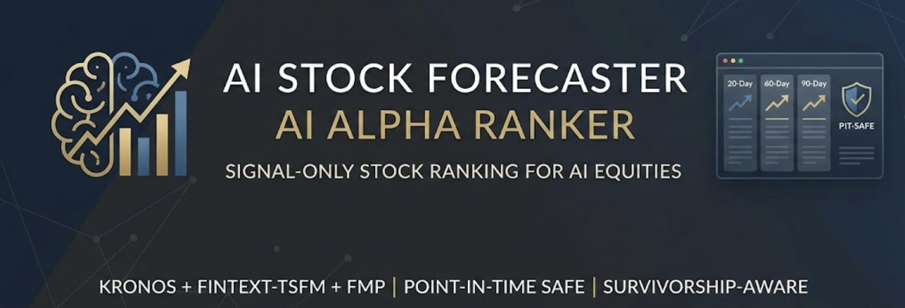

# AI Stock Forecaster



A research-grade, signal-only decision-support system for cross-sectional equity ranking with built-in uncertainty quantification and regime-aware deployment gating.

> **Which AI stocks are most attractive to buy today (risk-adjusted) over the next 20 / 60 / 90 trading days — and can we trust the model right now?**

---

## Headline Results

| Metric | Value | What It Means |
|--------|------:|---------------|
| Shadow portfolio Sharpe | **2.73** | Vol-sized LGB, 20d monthly L/S, 82.6% hit rate |
| FINAL holdout Sharpe | **2.34** | Strongly survives into 2024 out-of-sample (14 months) |
| Regime-trust AUROC | **0.72** (0.75 FINAL) | Knows when the model works vs. fails |
| Regime-gated precision | **80%** | When system says "trade," it's right 80% of the time |
| 2024 crisis detection | G(t) → 0 by April | Correctly triggers abstention during regime failure |
| Multi-crisis validation | **7/8** correct verdicts (VIX: 5/8) | G(t) validated across 5 stress + 3 calm episodes 2016–2025 |
| DEUP conformal intervals | **96× better** cond. coverage | Best-in-class calibrated prediction intervals |
| ê-Cap tail-risk guard | Gate+Vol+ê-Cap ALL Sharpe **0.884** | Beats Gate+Vol-only (+0.067); ê adds incremental value |
| Test coverage | **1,000+** tests | All passing |

---

## What This Project Does

- Generates **cross-sectional rankings** (top buys / neutral / avoid) for a dynamic universe of AI-exposed U.S. equities
- Produces **expected excess return** vs benchmark (QQQ) at **20 / 60 / 90 trading-day horizons**
- Provides **calibrated prediction intervals** (P5 / P50 / P95) via DEUP-normalized conformal prediction
- Estimates **per-stock uncertainty** (ê(x): which individual predictions are unreliable)
- Estimates **per-date regime trust** (G(t): whether the model is usable today)
- Enforces **strict PIT correctness** (no future leakage) and **survivorship-safe universe replay**
- Evaluates everything with **walk-forward splits**, **DEV/FINAL holdout protocol**, and **cost-realism overlays**

## What This Project Does *Not* Do

- No broker connections, no execution, no live capital management
- Portfolio construction exists only to test whether signals are economically meaningful after costs and turnover
- This is a **research system and decision-support tool**, not trading software

---

## Architecture Overview

The system combines multiple complementary information sources in a layered pipeline:

```
Data Layer (Ch 3-5)           Signal Layer (Ch 7-11)          Risk Layer (Ch 12-13)
─────────────────────         ───────────────────────         ──────────────────────
FMP fundamentals              LightGBM (primary)              Regime diagnostics
Polygon price data     →      FinText-TSFM (Ch 9)      →     DEUP uncertainty ê(x)
SEC filings/events            NLP Sentiment (Ch 10)           Expert health H(t)/G(t)
DuckDB feature store          Fusion models (Ch 11)           Conformal intervals
Regime context                Vol-sizing (Ch 12)              Binary deployment gate
```

**Two-level uncertainty:**

| Level | Signal | Question | Method |
|-------|--------|----------|--------|
| **Per-stock** | ê(x) | Which names are dangerous today? | DEUP error predictor on walk-forward residuals |
| **Per-date** | G(t) | Is the model usable today? | Health gate from trailing realized efficacy |

---

## Key Findings

### The Model Works — Until It Doesn't

The LightGBM ranker achieves exceptional in-sample performance across 2016–2023: Sharpe 2.73, 82.6% monthly hit rate, −18.1% max drawdown. It beats factor baselines by 3–10× and outperforms all fusion architectures at the 20d horizon.

In 2024, an AI-driven thematic rally restructured cross-sectional factor returns, causing signal degradation at all horizons. The 60d and 90d signals go negative. Only 20d survives (FINAL Sharpe 2.34, with higher volatility 58.7% vs DEV 25.5%).

### The System Knows When It Fails

The DEUP framework (Chapter 13) addresses this with a regime-trust gate:

- **G(t) ≥ 0.2 → trade.** Mean RankIC is positive, only 12% bad days.
- **G(t) < 0.2 → abstain.** Mean RankIC ≈ −0.01, 51% bad days (coinflip).
- AUROC = 0.72 for classifying good vs bad days — far above VIX (0.45, *worse than random*), market vol (0.60), or stock vol (0.59).
- During Mar–Jul 2024, G(t) drops to ~0 by April, correctly triggering full abstention and preventing April–July losses.

### Per-Stock Uncertainty Is Real (But Application Matters)

DEUP's epistemic signal ê(x) genuinely predicts which individual predictions will have high rank displacement (ρ = 0.14–0.25 with realized rank loss, 3–10× better than volatility or VIX). It survives residualization against vol/VIX, generalizes to the FINAL holdout (stronger in holdout than DEV), and produces calibrated conformal intervals with 96× better conditional coverage than raw conformal (conditional gap: 20.2% raw → 0.21% DEUP-normalized).

However, inverse-uncertainty *sizing* (reduce weight for high-ê stocks) creates a structural conflict: the model's strongest signals live at extreme cross-sectional ranks, which are also where ê is highest. Vol-sizing avoids this conflict and remains the best per-stock weighting method.

**Robustness check (13.9):** Rank Avg 2 produces 35% better ê(x) quality (ρ=0.194 vs LGB 0.144 at 20d), confirming DEUP's uncertainty signal responds to base model quality — it is not an LGB artefact. But LGB remains the deployment primary (stronger DEV signal, IC 0.091 vs 0.059). Once the G(t) gate is applied, both models achieve nearly identical FINAL Sharpe (0.958 vs 1.017), confirming the gate is the dominant value driver.

---

## Signal Quality

### All Models — Signal Metrics

| Model | Hz | Mean RankIC | Median RankIC | IC Stability | Cost Survival |
|-------|---:|:-----------:|:------------:|:------------:|:------------:|
| **LGB Baseline** | **20d** | **0.064** | **0.081** | 0.353 | **69.7%** |
| **LGB Baseline** | **60d** | **0.140** | **0.148** | 0.712 | 80.7% |
| **LGB Baseline** | **90d** | **0.165** | **0.183** | 0.797 | 81.7% |
| Vol-Sized LGB | 20d | 0.061 | 0.071 | 0.356 | 67.9% |
| FinText (TSFM) | 20d | 0.084 | — | — | — |
| Learned Stacking | 90d | 0.164 | 0.180 | 0.796 | 83.5% |
| Rank Avg 2 | 90d | 0.110 | 0.117 | 0.607 | 75.2% |

### Shadow Portfolio (20d, monthly L/S, annualized)

| Model | Sharpe | Sortino | Ann. Return | Max DD | Hit Rate |
|-------|:------:|:-------:|:----------:|:------:|:--------:|
| **Vol-Sized LGB** | **2.73** | **6.06** | **87.0%** | **−18.1%** | **82.6%** |
| LGB Baseline | 2.65 | 5.29 | 86.6% | −21.9% | 80.7% |
| Learned Stacking | 1.86 | 2.65 | 122.8% | −66.0% | 78.9% |
| Rank Avg 2 | 1.64 | 2.42 | 73.2% | −39.3% | 76.1% |

### Holdout Performance (DEV → FINAL)

| Period | Sharpe | Ann. Return | Max DD | Hit Rate |
|--------|:------:|:----------:|:------:|:--------:|
| DEV (2016–2023, 95 months) | **3.12** | 79.6% | −18.1% | 82.1% |
| FINAL (2024+, 14 months) | **2.34** | 137.3% | −8.7% | 85.7% |

---

## Project Status

| Chapter | Description | Status |
|---------|-------------|:------:|
| Ch 1–5 | Data infra, universe, features (PIT-safe) | ✅ Complete |
| Ch 6 | Evaluation framework | 🔒 Frozen |
| Ch 7 | ML baseline (LightGBM) | 🔒 Frozen |
| Ch 8 | Kronos time-series foundation model | ✅ Complete |
| Ch 9 | FinText-TSFM signal | ✅ Complete |
| Ch 10 | NLP sentiment (FinBERT) | ✅ Complete |
| Ch 11 | Fusion models | ✅ Complete |
| Ch 12 | Regime analysis + stress tests | ✅ Complete |
| **Ch 13** | **DEUP uncertainty quantification** | **⏳ 97%** |
| Ch 14–17 | Monitoring, interfaces, acceptance, extensions | ⏳ TODO |

### Chapter 13 (DEUP) Progress

| Section | Description | Status |
|---------|-------------|:------:|
| 13.0 | Residual archive + loss definition | ✅ |
| 13.1 | g(x) error predictor (walk-forward, 89 folds) | ✅ |
| 13.2 | Aleatoric baseline a(x) (4 tiers) | ✅ |
| 13.3 | Epistemic signal ê(x) = max(0, g−a) | ✅ |
| 13.4 | Diagnostics A–F + stability | ✅ |
| 13.4b | Expert health H(t) + exposure gate G(t) | ✅ |
| 13.5 | Conformal prediction intervals | ✅ |
| 13.6 | Shadow portfolio + regime evaluation | ✅ |
| 13.7 | Deployment policy + ablation | ✅ |
| 13.8 | Multi-crisis G(t) diagnostic (7/8 correct; VIX 5/8) | ✅ |
| 13.9 | DEUP on Rank Avg 2 (RA2 ê ρ=0.194 > LGB 0.144; retain LGB) | ✅ |
| 13.10 | Freeze & documentation | ⏳ Next |

---

## Quick Start

### 1. Install

```bash
python -m venv .venv
source .venv/bin/activate
pip install -r requirements.txt
```

### 2. Configure API Keys

Create `.env` (gitignored):

```properties
FMP_KEYS="your_fmp_api_key_here"
POLYGON_KEYS="your_polygon_api_key_here"
ALPHAVANTAGE_KEYS="your_alphavantage_api_key_here"
SEC_CONTACT_EMAIL="your_email@example.com"
```

### 3. Build the DuckDB Feature Store

```bash
python scripts/build_features_duckdb.py \
  --start-date 2016-01-01 \
  --end-date 2025-06-30 \
  --auto-normalize-splits
```

### 4. Run Evaluation Pipeline

```bash
# Factor baselines (Chapter 6)
python scripts/run_chapter6_closure.py

# ML baseline (Chapter 7)
python scripts/run_chapter7_tabular_lgb.py

# Regime analysis (Chapter 12)
python scripts/run_chapter12_heuristics.py

# DEUP uncertainty (Chapter 13 — all steps)
python -m scripts.run_chapter13_deup

# Or run individual DEUP steps
python -m scripts.run_chapter13_deup --step 0  # residual archive
python -m scripts.run_chapter13_deup --step 1  # g(x) error predictor
python -m scripts.run_chapter13_deup --step 4  # diagnostics
python -m scripts.run_chapter13_deup --step 5  # expert health H(t)
python -m scripts.run_chapter13_deup --step 6  # conformal intervals
python -m scripts.run_chapter13_deup --step 7  # portfolio + regime eval
```

### 5. Run Tests

```bash
pytest -q
```

---

## Repo Layout

```
src/
├── data/              FMP + Polygon + SEC data, DuckDB PIT store, trading calendar
├── features/          Labels, feature blocks, sentiment, missingness, neutralization
├── evaluation/        Walk-forward eval, cost diagnostics, stability reports, baselines
├── models/            Residual archive, fusion scorer, expert interface
├── uncertainty/       DEUP: error predictor, aleatoric, epistemic, health gate,
│                      conformal intervals, portfolio sizing, regime evaluation
├── universe/          Dynamic AI-stock universe with survivorship replay
├── outputs/           Signal output formatting
└── config.py          Central configuration

scripts/
├── build_features_duckdb.py     Build feature store
├── run_chapter6_closure.py      Factor baseline evaluation
├── run_chapter7_tabular_lgb.py  ML baseline evaluation
├── run_chapter12_heuristics.py  Regime analysis + stress tests
├── run_chapter13_deup.py        DEUP uncertainty pipeline (steps 0–7)
└── run_shadow_portfolio.py      Shadow portfolio construction

documentation/
├── RESULTS.md         Comprehensive results from all chapters
├── CHAPTER_13.md      DEUP uncertainty quantification (detailed)
├── CHAPTER_12.md      Regime analysis + holdout diagnostics
├── CHAPTER_11.md      Fusion model evaluation
├── ROADMAP.md         Full project roadmap and progress
└── ...

evaluation_outputs/
├── chapter6_closure_real/   Frozen factor baselines (immutable)
├── chapter7_tabular_lgb_full/  Frozen ML baseline
├── chapter12/               Regime diagnostics, stress tests, holdout
└── chapter13/               DEUP outputs (ehat, health, conformal, portfolio)

tests/                 1,000+ unit and integration tests
```

---

## Core Design Principles

1. **Ranking beats regression.** Relative ordering is more stable than price forecasts. All evaluation uses RankIC, not R².
2. **PIT correctness is non-negotiable.** Features must be available at time *T* to be used at *T*. Survivorship bias is handled via stable IDs and delisting replay.
3. **Economic validity > statistical fit.** Signals must survive transaction costs, turnover constraints, and regime shifts. A high RankIC that churns 100%/month is worthless.
4. **Know when to step aside.** The regime-trust gate G(t) is as important as the signal itself. A model that trades through regime failures will eventually blow up.
5. **DEV/FINAL holdout is sacred.** All metrics are reported for both pre-2024 (DEV) and 2024+ (FINAL). In-sample results without holdout validation are not credible.

---

## Theoretical Foundation

The uncertainty quantification framework implements DEUP (Direct Epistemic Uncertainty Prediction, Lahlou et al. 2023) adapted to cross-sectional ranking:

- **g(x):** Error predictor trained on walk-forward residuals. Estimates total expected rank displacement per stock.
- **a(x):** Aleatoric baseline. Estimates irreducible ranking noise (market-level at 20d, per-stock at 60d via LGB quantile regression).
- **ê(x) = max(0, g(x) − a(x)):** Epistemic signal. Excess predicted error beyond the noise floor.
- **H(t) / G(t):** Expert health gate. Trailing realized efficacy (PIT-safe) → binary deployment decision.

Conformal prediction intervals follow the motivation of Plassier et al. (2025), normalizing nonconformity scores by ê(x) to achieve conditional validity. DEUP-normalized intervals reduce conditional coverage spread 96× vs raw conformal (20.2% → 0.21%).

The framework instantiates the pointwise risk decomposition of Kotelevskii & Panov (ICLR 2025): Total Risk = Bayes Risk + Excess Risk, adapted from return-space to ranking-space.

---

## Reproducibility

- Evaluation definitions are locked in `src/evaluation/definitions.py`
- Walk-forward embargo is enforced (min 90 trading days); overlapping labels are purged
- Label maturity uses `label_matured_at` (UTC market-close cutoffs)
- Chapter 6 and 7 artifacts are immutable comparison anchors
- All calibration (sizing constants, health thresholds) is fitted on DEV only, then frozen for FINAL
- Random seeds are fixed; outputs are deterministic

---

## Documentation

| Document | Description |
|----------|-------------|
| [`documentation/RESULTS.md`](documentation/RESULTS.md) | Comprehensive results from all chapters |
| [`documentation/ROADMAP.md`](documentation/ROADMAP.md) | Full project roadmap with progress tracking |
| [`documentation/CHAPTER_13.md`](documentation/CHAPTER_13.md) | DEUP uncertainty quantification (detailed methodology + results) |
| [`documentation/CHAPTER_12.md`](documentation/CHAPTER_12.md) | Regime analysis, stress tests, holdout diagnostics |
| [`documentation/CHAPTER_11.md`](documentation/CHAPTER_11.md) | Fusion model evaluation |
| [`outline.ipynb`](outline.ipynb) | Full project outline with per-chapter plans and results |

---

## Disclaimer

This repository is for research and decision-support purposes only. It does not provide investment advice, does not execute trades, and makes no guarantees about future performance. The 2024 holdout results demonstrate that model performance can and does degrade during regime shifts. Use at your own risk.
