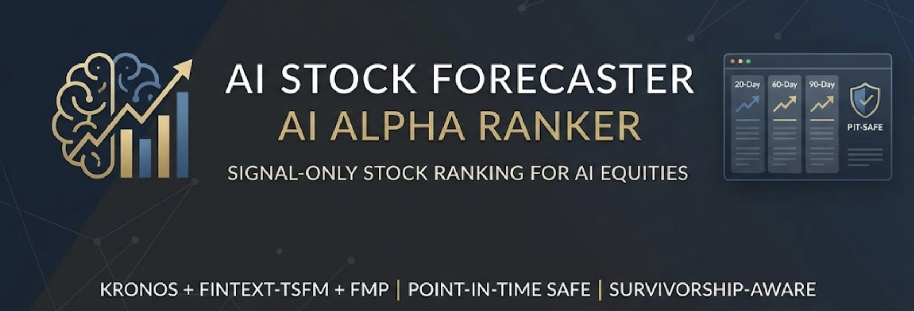

# AI Stock Forecaster
**Kronos + FinText-TSFM + FMP | Signal-Only Stock Ranking for AI Equities**



A decision-support forecasting system that answers:

> **Which AI stocks are most attractive to buy today (risk-adjusted) over the next 20 / 60 / 90 trading days?**

This repo produces **ranked signals + return distributions** — **not trades**.

This project is a **point-in-time safe, survivorship-aware forecasting system** that produces **ranked, risk-adjusted buy attractiveness signals** for a dynamic universe of AI-exposed U.S. equities. On each rebalance date, it generates **cross-sectional rankings** (top buys / neutral / avoid) and **per-stock return distributions** over **20 / 60 / 90 trading-day horizons**, expressed as **excess total return vs a benchmark** (QQQ by default). The pipeline is designed for credibility under real financial constraints: all features obey strict **as-of cutoffs** (no lookahead), fundamentals are handled as-reported with **release timestamps**, delistings/ticker changes are handled via **stable IDs**, and evaluation uses a locked **walk-forward, embargoed** framework with **cost and churn diagnostics** to test whether signals remain economically meaningful. The system is explicitly **signal-only** (no brokerage connectivity or execution) and prioritizes **ranking quality and stability** over price regression, combining complementary information sources including **price dynamics (Kronos)**, **return structure (FinText-TSFM)**, and **tabular context (FMP fundamentals/events/regime features)**.

---

## What this project does
- Generates **cross-sectional rankings** (Top buys / neutral / avoid) for an AI-stock universe
- Outputs **expected excess return vs benchmark** (default: `QQQ`, optional: `XLK/SMH`)
- Produces **return distributions** (P5 / P50 / P95) + **confidence** (calibrated uncertainty)
- Enforces **strict PIT correctness** (no future leakage) + **survivorship-safe universe replay**
- Evaluates signals with **walk-forward** splits + **cost realism** overlays (diagnostic)

## What this project does *not* do
- No broker connections, no execution, no live capital management
- Portfolio logic exists **only** to test whether signals remain economically meaningful **after costs/turnover**

---

## Core philosophy (why it's built this way)
- **Ranking beats regression:** relative ordering is more stable than precise price forecasts
- **PIT correctness is non-negotiable:** features must be available at time *T* to be used at *T*
- **Economic validity > statistical fit:** signals must survive costs, churn, and regime shifts
- **Multiple weak signals > one strong model:** price dynamics (Kronos) + return structure (FinText) + context (tabular)

---

## Outputs (signal-only)
Per rebalance date **T**, per stock, per horizon (20/60/90 trading days):
- Expected **excess return** vs benchmark
- **Distribution**: P5 / P50 / P95
- **Alpha score** (used for ranking)
- **Confidence score**
- **Key drivers** (feature blocks influencing rank)

Cross-sectional:
- Ranked list: **Top buys / neutral / avoid**
- Optional confidence buckets (high vs low confidence)

---

## Status (high level)
✅ **Ch 1–5:** Data infra + survivorship-safe universe + feature stack (PIT-safe)  
🔒 **Ch 6:** Evaluation framework **CLOSED & FROZEN** (baseline reference is immutable)  
✅ **Ch 7:** ML baseline (`tabular_lgb`) **FROZEN** (the floor models must beat)  
🟢 **Next:** Ch 8 Kronos integration → Ch 9 FinText → Ch 11 Fusion

### Frozen evaluation floor (REAL data, Chapter 6)
- **20d:** best factor baseline median RankIC = **0.0283**
- **60d:** best factor baseline median RankIC = **0.0392**
- **90d:** best factor baseline median RankIC = **0.0169**

Artifacts tracked in git:
- `evaluation_outputs/chapter6_closure_real/` (immutable baseline reference)

### Frozen ML baseline floor (Chapter 7: `tabular_lgb`)
- **20d:** RankIC **0.1009**
- **60d:** RankIC **0.1275**
- **90d:** RankIC **0.1808**

Artifacts tracked in git:
- `evaluation_outputs/chapter7_tabular_lgb_full/`

---

## Quick start

### 1) Install
```bash
python -m venv .venv
source .venv/bin/activate
pip install -r requirements.txt
# or layer installs (recommended):
# pip install -r requirements/base.txt
# pip install -r requirements/ml.txt
# pip install -r requirements/dev.txt
```

### 2) Configure API keys
Create `.env` (gitignored):
```properties
FMP_KEYS="your_fmp_api_key_here"
POLYGON_KEYS="your_polygon_api_key_here"
ALPHAVANTAGE_KEYS="your_alphavantage_api_key_here"
SEC_CONTACT_EMAIL="your_email@example.com"
```

### 3) Build the DuckDB feature store
```bash
python scripts/build_features_duckdb.py \
  --start-date 2016-01-01 \
  --end-date 2025-06-30 \
  --auto-normalize-splits
```

### 4) Run the frozen baseline reference (Chapter 6 closure)
```bash
python scripts/run_chapter6_closure.py
# Outputs: evaluation_outputs/chapter6_closure_real/
```

### 5) Run baselines (incl. frozen ML baseline)
```bash
python scripts/run_chapter7_tabular_lgb.py
# Outputs: evaluation_outputs/chapter7_tabular_lgb_full/
```

### 6) Run tests
```bash
pytest -q
```

---

## Repo layout (minimal map)
- `src/data/` — FMP + Polygon + SEC/Events + PIT store (DuckDB)
- `src/features/` — Labels + feature blocks + missingness + hygiene + neutralization
- `src/evaluation/` — Frozen walk-forward eval, costs, stability reports, baselines
- `scripts/` — Build DuckDB, run closures, run baselines
- `evaluation_outputs/` — Evaluation artifacts (some tracked, most gitignored)
- `tests/` — Unit + integration test suites (PIT discipline enforced)

---

## Reproducibility & guardrails
- Evaluation definitions are locked in `src/evaluation/definitions.py`
- Embargo is enforced (min 90 trading days); overlapping labels are purged
- Label maturity is enforced using `label_matured_at` (UTC market-close cutoffs)
- No baseline shopping: Chapter 6/7 artifacts are the comparison anchor for all future models

---

## Disclaimer
This repository is for research and decision-support. It does not provide investment advice and does not execute trades. Use at your own risk.

---

## Key docs
- `CHAPTER_6_FREEZE.md` — frozen evaluation definitions + baseline reference
- `evaluation_outputs/chapter6_closure_real/BASELINE_REFERENCE.md`
- `evaluation_outputs/chapter7_tabular_lgb_full/BASELINE_REFERENCE.md`
- `CHAPTER_8_PLAN.md` — Kronos integration plan
